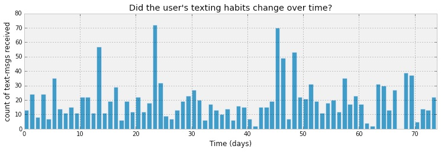

# HMM (Hidden Markov Model) example

## Abstract

In this tutorial, we will use an example of a widely used model, the HMM, to demonstrate some core blang concepts. The answers can be found [here](https://github.com/UBC-Stat-ML/blangSDK/blob/master/src/main/java/blang/examples/Texting.bl). See also more example [here](https://github.com/UBC-Stat-ML/blangSDK/tree/master/src/main/java/blang/examples).

## Prerequisites

We assume the material of [getting started](../getting-started.md) has been covered. For convenience, here are the main resource links you may need here:

- [Available distributions](https://github.com/UBC-Stat-ML/blangSDK/tree/master/src/main/java/blang/distributions)
- [Available types](https://github.com/UBC-Stat-ML/blangSDK/tree/master/src/main/java/blang/types)
- [Utility functions, in particular, to instantiate variables](https://github.com/UBC-Stat-ML/blangSDK/blob/master/src/main/java/blang/utils/StaticUtils.xtend)
- [Reference to useful java packages](https://docs.oracle.com/javase/7/docs/api/java/util/package-summary.html)

## Data and problem

Let's look at the texting habits data from [Cameron Davidson-Pilon's excellent book](http://nbviewer.jupyter.org/github/CamDavidsonPilon/Probabilistic-Programming-and-Bayesian-Methods-for-Hackers/blob/master/Chapter1_Introduction/Chapter1.ipynb):



[Raw data](hmm_files/texting-data.csv)

The question will be the same as in the above book, but we will use a different route: an HMM.


## Skeleton

Here is a skeleton to start from. Start with modelling each day with an iid Poisson for simplicity

```
import blang.types.*
import java.util.*
import xlinear.*

import static extension blang.utils.ExtensionUtils.* 
import static extension xlinear.MatrixExtensions.* 
import static blang.utils.StaticUtils.*
import static xlinear.MatrixOperations.* 

model Texting {
  
  random List<IntVar>     data
  
  // TODO  
  
  laws {
    
    // TODO
        
  }
}
```

Hint: loops have the form

```
for (int latentIdx : startInclusive ..< endExclusive) { 
    ... 
}
```

Note: data structures are 0-indexed.

## Adding a mixture structure

Now, introduce some latent states, one for each observation (say integer-value). Use a mixture of two Poissons with prior probability 50-50 on the two mixture components.

Hint: you will need a new list of int valued random variable. To condition on one element in a list, use:

```
 ... | IntVar curLatent = chain.get(obsIdx), ... ~ ... 
```


## Adding a Markov structure

Make the latent states depend on each other in a "sticky" way (i.e. if one is equal to x, make the probability high that it will stay at x.)

You can fix these parameters as follows:

```
  param  Simplex          initialDist   ?: simplex(2)
  param  TransitionMatrix transMtx      ?: 
    transitionMatrix(#[
      #[0.99, 0.01],
      #[0.01, 0.99]
    ]) 
```


## Making the Markov chain reusable

Pull the code that takes care of the Markov structure into a separate blang file. Invoke that distribution to construct the chain.


